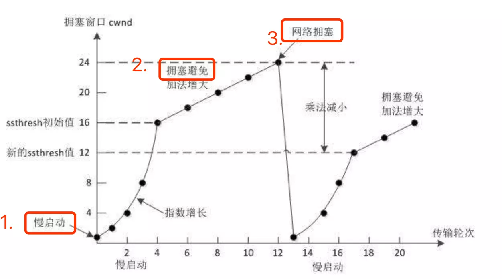
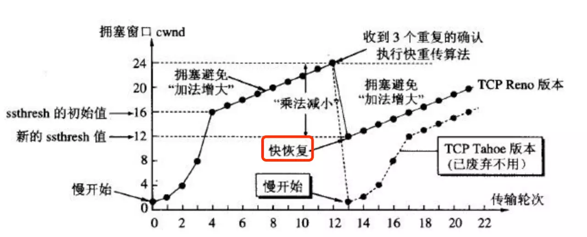

### http 响应常见状态码

-   100-199 : 表示成功接收请求, 要求客户端继续提交下一次请求才能完成整个处理过程
-   200-299: 表示成果接收请求并已完成整个处理过程. 常用 200
-   300-399: 为完成请求, 客户需进一步细化需求: 例如: 请求的资源已经移动一个新地址, 常用 302(重定向), 307 和 304(拿缓存)
-   400-499: 客户端的请求有错误, 包含语法错误或者不能正确执行. 常用 404(请求的资源在 web 服务器中没有) 403(服务器拒绝访问, 权限不够)
-   500-599: 服务器端出现错误

常用：

-   200 正常，表示一切正常, 返回的是正常请求结果
-   302/307 临时重定向，指出请求的文档已被临时移动到别处, 此文档的新的 url 在 location 响应头中给出
-   304 未修改，表示客户机缓存的版本是最新的, 客户机应该继续使用它
-   403 禁止，服务器理解客户端请求, 但拒绝处理它, 通常用于服务器上文件或目录的权限设置所致
-   404 找不到，服务器上不存在客户机所请求的资源
-   500 服务器内部错误，服务器端的 cgi, asp, jsp 等程序发生错误

### 简述 http 1.1 与 http 1.0 的区别

-   http 1.0 对于每个连接都得建立一次连接, 一次只能传送一个请求和响应, 请求就会关闭, http1.0 没有 Host 字段
-   而 http1.1 在同一个连接中可以传送多个请求和响应, 多个请求可以重叠和同时进行, http1.1 必须有 host 字段
-   http1.1 中引入了 ETag 头, 它的值 entity tag 可以用来唯一的描述一个资源. 请求消息中可以使用 If-None-Match 头域来匹配资源的 entitytag 是否有变化
-   http1.1 新增了 Cache-Control 头域(消息请求和响应请求都可以使用), 它支持一个可扩展的指令子集
-   http1.0 中只定义了 16 个状态响应码, 对错误或警告的提示不够具体. http1.1 引入了一个 Warning 头域, 增加对错误或警告信息的描述. 且新增了 24 个状态响应码

### 说一下 TCP 三次握手和四次挥手

-   建立 TCP 连接需要三次握手:三次握手: 首先 Client 端发送连接请求报文，Server 段接受连接后回复 ACK 报文，并为这次连接分配资源。Client 端接收到 ACK 报文后也向 Server 段发生 ACK 报文，并分配资源，这样 TCP 连接就建立了。
    -   第一步: 客户机的 TCP 先向服务器的 TCP 发送一个连接请求报文. 这个特殊的报文中不含应用层数据, 其首部中的 SYN 标志位被置 1. 另外, 客户机会随机选择一个起始序号 seq=x(连接请求报文不携带数据,但要消耗掉一个序号)
    -   第二步: 服务器端的 TCP 收到连接请求报文后, 若同意建立连接, 就向客户机发送请求, 并为该 TCP 连接分配 TCP 缓存和变量. 在确认报文中,SYN 和 ACK 位都被置为 1, 确认号字段的值为 x+1, 并且服务器随机产生起始序号 seq=y(确认报文不携带数据, 但也要消耗掉一个序号). 确认报文同样不包含应用层数据.
    -   第三步: 当客户机收到确认报文后, 还要向服务器给出确认, 并且也要给该连接分配缓存和变量. 这个报文的 ACK 标志位被置为 1, 序号字段为 x+1, 确认号字段为 y+1
-   四次挥手
    -   第一步: 客户机打算关闭连接,就向其 TCP 发送一个连接释放报文,并停止再发送数据,主动关闭 TCP 连接, 该报文的 FIN 标志位被置 1, seq=u, 它等于前面已经传送过的数据的最后一个字节的序号加 1(FIN 报文即使不携带数据,也要消耗掉一个序号)
    -   第二步: 服务器接收连接释放报文后即发出确认, 确认号是 ack=u+1, 这个报文自己的序号是 v, 等于它前面已传送过的数据的最后一个自己的序号加 1. 此时, 从客户机到服务器这个方向的连接就释放了, TCP 连接处于半关闭状态. 但服务器若发送数据, 客户机仍要接收, 即从服务器到客户机的连接仍未关闭.
    -   第三步: 若服务器已经没有了要向客户机发送的数据, 就通知 TCP 释放连接, 此时其发出 FIN=1 的连接释放报文
    -   第四步: 客户机收到连接释放报文后, 必须发出确认. 在确认报文中, ACK 字段被置为 1, 确认号 ack=w+1, 序号 seq=u+1. 此时, TCP 连接还没有释放掉, 必须经过等待计时器设置的时间 2MSL 后, A 才进入到连接关闭状态.

### 计算机网络体系结构有哪些


学习计算机网络时我们一般采用折中的办法，也就是中和 OSI 和 TCP/IP 的优点，采用一种只有五层协议的体系结构，这样既简洁又能将概念阐述清楚。

#### 应用层

应用层(application-layer）的任务是通过应用进程间的交互来完成特定网络应用。应用层协议定义的是应用进程（进程：主机中正在运行的程序）间的通信和交互的规则。对于不同的网络应用需要不同的应用层协议。在互联网中应用层协议很多，如域名系统 DNS，支持万维网应用的 HTTP 协议，支持电子邮件的 SMTP 协议等等。我们把应用层交互的数据单元称为报文。

**域名系统**

-   域名系统(Domain Name System 缩写 DNS，Domain Name 被译为域名)是因特网的一项核心服务，它作为可以将域名和 IP 地址相互映射的一个分布式数据库，能够使人更方便的访问互联网，而不用去记住能够被机器直接读取的 IP 数串。（百度百科）例如：一个公司的 Web 网站可看作是它在网上的门户，而域名就相当于其门牌地址，通常域名都使用该公司的名称或简称。例如上面提到的微软公司的域名，类似的还有：IBM 公司的域名是 www.ibm.com、Oracle 公司的域名是 www.oracle.com、Cisco 公司的域名是 www.cisco.com 等。

**HTTP 协议**

-   超文本传输协议（HTTP，HyperText Transfer Protocol)是互联网上应用最为广泛的一种网络协议。所有的 WWW（万维网） 文件都必须遵守这个标准。设计 HTTP 最初的目的是为了提供一种发布和接收 HTML 页面的方法。（百度百科）

#### 运输层

运输层(transport layer)的主要任务就是负责向两台主机进程之间的通信提供通用的数据传输服务。应用进程利用该服务传送应用层报文。“通用的”是指并不针对某一个特定的网络应用，而是多种应用可以使用同一个运输层服务。由于一台主机可同时运行多个线程，因此运输层有复用和分用的功能。所谓复用就是指多个应用层进程可同时使用下面运输层的服务，分用和复用相反，是运输层把收到的信息分别交付上面应用层中的相应进程。

**运输层主要使用以下两种协议**

-   传输控制协议 TCP（Transmisson Control Protocol）--提供面向连接的，可靠的数据传输服务。
-   用户数据协议 UDP（User Datagram Protocol）--提供无连接的，尽最大努力的数据传输服务（不保证数据传输的可靠性）。

**UDP 的主要特点**

-   UDP 是无连接的；
-   UDP 使用尽最大努力交付，即不保证可靠交付，因此主机不需要维持复杂的链接状态（这里面有许多参数）；
-   UDP 是面向报文的；
-   UDP 没有拥塞控制，因此网络出现拥塞不会使源主机的发送速率降低（对实时应用很有用，如 直播，实时视频会议等）；
-   UDP 支持一对一、一对多、多对一和多对多的交互通信；
-   UDP 的首部开销小，只有 8 个字节，比 TCP 的 20 个字节的首部要短。

**TCP 的主要特点**

-   TCP 是面向连接的。（就好像打电话一样，通话前需要先拨号建立连接，通话结束后要挂机释放连接）；
-   每一条 TCP 连接只能有两个端点，每一条 TCP 连接只能是点对点的（一对一）；
-   TCP 提供可靠交付的服务。通过 TCP 连接传送的数据，无差错、不丢失、不重复、并且按序到达；
-   TCP 提供全双工通信。TCP 允许通信双方的应用进程在任何时候都能发送数据。TCP 连接的两端都设有发送缓存和接收缓存，用来临时存放双方通信的数据；
-   面向字节流。TCP 中的“流”（Stream）指的是流入进程或从进程流出的字节序列。“面向字节流”的含义是：虽然应用程序和 TCP 的交互是一次一个数据块（大小不等），但 TCP 把应用程序交下来的数据仅仅看成是一连串的无结构的字节流。

#### 网络层

在 计算机网络中进行通信的两个计算机之间可能会经过很多个数据链路，也可能还要经过很多通信子网。网络层的任务就是选择合适的网间路由和交换结点， 确保数据及时传送。 在发送数据时，网络层把运输层产生的报文段或用户数据报封装成分组和包进行传送。在 TCP/IP 体系结构中，由于网络层使用 IP 协议，因此分组也叫 IP 数据报 ，简称 数据报。

这里要注意：不要把运输层的“用户数据报 UDP ”和网络层的“ IP 数据报”弄混。另外，无论是哪一层的数据单元，都可笼统地用“分组”来表示。

这里强调指出，网络层中的“网络”二字已经不是我们通常谈到的具体网络，而是指计算机网络体系结构模型中第三层的名称.

互联网是由大量的异构（heterogeneous）网络通过路由器（router）相互连接起来的。互联网使用的网络层协议是无连接的网际协议（Intert Prococol）和许多路由选择协议，因此互联网的网络层也叫做网际层或 IP 层。

#### 数据链路层

数据链路层(data link layer)通常简称为链路层。两台主机之间的数据传输，总是在一段一段的链路上传送的，这就需要使用专门的链路层的协议。 在两个相邻节点之间传送数据时，数据链路层将网络层交下来的 IP 数据报组装程帧，在两个相邻节点间的链路上传送帧。每一帧包括数据和必要的控制信息（如同步信息，地址信息，差错控制等）。

在接收数据时，控制信息使接收端能够知道一个帧从哪个比特开始和到哪个比特结束。这样，数据链路层在收到一个帧后，就可从中提出数据部分，上交给网络层。 控制信息还使接收端能够检测到所收到的帧中有误差错。如果发现差错，数据链路层就简单地丢弃这个出了差错的帧，以避免继续在网络中传送下去白白浪费网络资源。如果需要改正数据在链路层传输时出现差错（这就是说，数据链路层不仅要检错，而且还要纠错），那么就要采用可靠性传输协议来纠正出现的差错。这种方法会使链路层的协议复杂些。

#### 物理层

在物理层上所传送的数据单位是比特。 物理层(physical layer)的作用是实现相邻计算机节点之间比特流的透明传送，尽可能屏蔽掉具体传输介质和物理设备的差异。 使其上面的数据链路层不必考虑网络的具体传输介质是什么。“透明传送比特流”表示经实际电路传送后的比特流没有发生变化，对传送的比特流来说，这个电路好像是看不见的。

在互联网使用的各种协中最重要和最著名的就是 TCP/IP 两个协议。现在人们经常提到的 TCP/IP 并不一定单指 TCP 和 IP 这两个具体的协议，而往往表示互联网所使用的整个 TCP/IP 协议族。

上面我们对计算机网络的五层体系结构有了初步的了解，下面附送一张七层体系结构图总结一下。图片来源：https://blog.csdn.net/yaopeng_2005/article/details/7064869


### Http 和 Https 的区别（常考）

-   Http 协议运行在 TCP 之上，明文传输，客户端与服务器端都无法验证对方的身份；Https 是身披 SSL(Secure Socket Layer)外壳的 Http，运行于 SSL 上，SSL 运行于 TCP 之上，是添加了加密和认证机制的 HTTP。二者之间存在如下不同：
-   端口不同：Http 与 Http 使用不同的连接方式，用的端口也不一样，前者是 80，后者是 443；
-   资源消耗：和 HTTP 通信相比，Https 通信会由于加减密处理消耗更多的 CPU 和内存资源；
-   开销：Https 通信需要证书，而证书一般需要向认证机构购买；
-   Https 的加密机制是一种共享密钥加密和公开密钥加密并用的混合加密机制。

### 对称加密与非对称加密

-   对称密钥加密是指加密和解密使用同一个密钥的方式，这种方式存在的最大问题就是密钥发送问题，即如何安全地将密钥发给对方；而非对称加密是指使用一对非对称密钥，即公钥和私钥，公钥可以随意发布，但私钥只有自己知道。发送密文的一方使用对方的公钥进行加密处理，对方接收到加密信息后，使用自己的私钥进行解密。
-   由于非对称加密的方式不需要发送用来解密的私钥，所以可以保证安全性；但是和对称加密比起来，它非常的慢，所以我们还是要用对称加密来传送消息，但对称加密所使用的密钥我们可以通过非对称加密的方式发送出去。

### TCP 协议如何来保证传输的可靠性

TCP 提供一种面向连接的、可靠的字节流服务。其中，面向连接意味着两个使用 TCP 的应用（通常是一个客户和一个服务器）在彼此交换数据之前必须先建立一个 TCP 连接。在一个 TCP 连接中，仅有两方进行彼此通信；而字节流服务意味着两个应用程序通过 TCP 链接交换 8bit 字节构成的字节流，TCP 不在字节流中插入记录标识符。

对于可靠性，TCP 通过以下方式进行保证：

-   数据包校验：目的是检测数据在传输过程中的任何变化，若校验出包有错，则丢弃报文段并且不给出响应，这时 TCP 发送数据端超时后会重发数据；
-   对失序数据包重排序：既然 TCP 报文段作为 IP 数据报来传输，而 IP 数据报的到达可能会失序，因此 TCP 报文段的到达也可能会失序。TCP 将对失序数据进行重新排序，然后才交给应用层；
-   丢弃重复数据：对于重复数据，能够丢弃重复数据；
-   应答机制：当 TCP 收到发自 TCP 连接另一端的数据，它将发送一个确认。这个确认不是立即发送，通常将推迟几分之一秒；
-   超时重发：当 TCP 发出一个段后，它启动一个定时器，等待目的端确认收到这个报文段。如果不能及时收到一个确认，将重发这个报文段；
-   流量控制：TCP 连接的每一方都有固定大小的缓冲空间。TCP 的接收端只允许另一端发送接收端缓冲区所能接纳的数据，这可以防止较快主机致使较慢主机的缓冲区溢出，这就是流量控制。TCP 使用的流量控制协议是可变大小的滑动窗口协议。

参考链接[ 计算机网络面试问题集锦](https://blog.csdn.net/justloveyou_/article/details/78303617)

### 查找域名对应 IP 地址

这一步包括 DNS 具体的查找过程，包括：浏览器缓存->系统缓存->路由器缓存...

-   浏览器搜索自己的 DNS 缓存（维护一张域名与 IP 地址的对应表）；
-   搜索操作系统中的 DNS 缓存（维护一张域名与 IP 地址的对应表）；
-   搜索操作系统的 hosts 文件（ Windows 环境下，维护一张域名与 IP 地址的对应表）；
-   操作系统将域名发送至 LDNS（本地区域名服务器），LDNS 查询 自己的 DNS 缓存（一般查找成功率在 80% 左右），查找成功则返回结果，失败则发起一个迭代 DNS 解析请求：
    -   LDNS 向 Root Name Server （根域名服务器，如 com、net、org 等的解析的顶级域名服务器的地址）发起请求，此处，Root Name Server 返回 com 域的顶级域名服务器的地址；
    -   LDNS 向 com 域的顶级域名服务器发起请求，返回 baidu.com 域名服务器地址；
    -   LDNS 向 baidu.com 域名服务器发起请求，得到 www.baidu.com 的 IP 地址；
-   LDNS 将得到的 IP 地址返回给操作系统，同时自己也将 IP 地址缓存起来；
-   操作系统将 IP 地址返回给浏览器，同时自己也将 IP 地址缓存起来；

### 从输入 URL 到页面加载发生了什么【必考】

总体来说分为以下几个过程:

-   DNS 解析
-   TCP 连接
-   发送 HTTP 请求
-   服务器处理请求并返回 HTTP 报文
-   浏览器解析渲染页面
-   连接结束

这道题的区分度很高建议大家仔细查看下面这篇文章[从输入 URL 到页面加载发生了什么](https://segmentfault.com/a/1190000006879700)

### HTTP 的几种请求方法用途

-   GET 方法：发送一个请求来取得服务器上的某一资源
-   POST 方法：向 URL 指定的资源提交数据或附加新的数据
-   PUT 方法：跟 POST 方法很像，也是想服务器提交数据。但是，它们之间有不同。PUT 指定了资源在服务器上的位置，而 POST 没有
-   HEAD 方法：只请求页面的首部
-   DELETE 方法：删除服务器上的某资源
-   OPTIONS 方法：它用于获取当前 URL 所支持的方法。如果请求成功，会有一个 Allow 的头包含类似“GET,POST”这样的信息
-   TRACE 方法：TRACE 方法被用于激发一个远程的，应用层的请求消息回路
-   CONNECT 方法：把请求连接转换到透明的 TCP/IP 通道

### 127.0.0.1 与 192.168.0.1 有什么区别【可能考】

首先明确二者没有区别！两个 IP 地址的角度不一样，127.0.0.1 是从 IETF（因特尔工程任务组）规定看，是保留给本机使用的 IP 地址，所有的计算机默认都是相同的。而 192.168.0.1 其实只是 IETF 在 c 类网址中，专门留出给专用网络用的一个网段中的一个 IP 而已，该网段包含了 192.168.0.1 到 192.168.255.255 中所有的 IP 地址。

### 五类 ip 地址的范围

IP 地址分为 A,B,C,D,E 五类。

网络号：用于识别主机所在的网络；
主机号：用于识别该网络中的主机。

其中 A 类分配给政府机关使用，B 类地址给大中型企业使用，C 类地址给个人使用。这三种是主要的。

IP 地址分为五类，A 类保留给政府机构，B 类分配给中等规模的公司，C 类分配给任何需要的人，D 类用于组播，E 类用于实验，各类可容纳的地址数目不同。

其中 A 类、B 类、和 C 类这三类地址用于 TCP/IP 节点，其它两类 D 类和 E 类被用于特殊用途。
A、B、C 三类 IP 地址的特征：当将 IP 地址写成二进制形式时，A 类地址的第一位总是 O，B 类地址的前两位总是 10，C 类地址的前三位总是 110。

A 类地址

-   ⑴ A 类地址第 1 字节为网络地址，其它 3 个字节为主机地址。
-   ⑵ A 类地址范围：1.0.0.1—126.155.255.254
-   ⑶ A 类地址中的私有地址和保留地址：
    -   ① 10.X.X.X 是私有地址（所谓的私有地址就是在互联网上不使用，而被用在局域网络中的地址）。
    -   ② 127.X.X.X 是保留地址，用做循环测试用的。

B 类地址

-   ⑴ B 类地址第 1 字节和第 2 字节为网络地址，其它 2 个字节为主机地址。
-   ⑵ B 类地址范围：128.0.0.1—191.255.255.254。
-   ⑶ B 类地址的私有地址和保留地址
    -   ① 172.16.0.0—172.31.255.255 是私有地址
    -   ② 169.254.X.X 是保留地址。如果你的 IP 地址是自动获取 IP 地址，而你在网络上又没有找到可用的 DHCP 服务器。就会得到其中一个 IP。

C 类地址

-   ⑴ C 类地址第 1 字节、第 2 字节和第 3 个字节为网络地址，第 4 个个字节为主机地址。另外第 1 个字节的前三位固定为 110。
-   ⑵ C 类地址范围：192.0.0.1—223.255.255.254。
-   ⑶ C 类地址中的私有地址：
    -   192.168.X.X 是私有地址。

D 类地址

-   ⑴ D 类地址不分网络地址和主机地址，它的第 1 个字节的前四位固定为 1110。
-   ⑵ D 类地址范围：224.0.0.1—239.255.255.254

E 类地址

-   ⑴ E 类地址也不分网络地址和主机地址，它的第 1 个字节的前五位固定为 11110。
-   ⑵ E 类地址范围：240.0.0.1—255.255.255.254

### HTTP 长连接、短连接

在 HTTP/1.0 中默认使用短连接。也就是说，客户端和服务器每进行一次 HTTP 操作，就建立一次连接，任务结束就中断连接。当客户端浏览器访问的某个 HTML 或其他类型的 Web 页中包含有其他的 Web 资源（如 JavaScript 文件、图像文件、CSS 文件等），每遇到这样一个 Web 资源，浏览器就会重新建立一个 HTTP 会话。

而从 HTTP/1.1 起，默认使用长连接，用以保持连接特性。使用长连接的 HTTP 协议，会在响应头加入这行代码：

```
Connection:keep-alive
```

在使用长连接的情况下，当一个网页打开完成后，客户端和服务器之间用于传输 HTTP 数据的 TCP 连接不会关闭，客户端再次访问这个服务器时，会继续使用这一条已经建立的连接。Keep-Alive 不会永久保持连接，它有一个保持时间，可以在不同的服务器软件（如 Apache）中设定这个时间。实现长连接需要客户端和服务端都支持长连接。

HTTP 协议的长连接和短连接，实质上是 TCP 协议的长连接和短连接。

[HTTP 长连接、短连接究竟是什么？](https://www.cnblogs.com/gotodsp/p/6366163.html)

### 如何理解 HTTP 协议是无状态的【常考】

HTTP 协议是无状态的，指的是协议对于事务处理没有记忆能力，服务器不知道客户端是什么状态。也就是说，打开一个服务器上的网页和上一次打开这个服务器上的网页之间没有任何联系。HTTP 是一个无状态的面向连接的协议，无状态不代表 HTTP 不能保持 TCP 连接，更不能代表 HTTP 使用的是 UDP 协议（无连接）。

### 各种协议与 HTTP 协议之间的关系

一般面试官会通过这样的问题来考察你对计算机网络知识体系的理解。


### Socket 连接与 HTTP 连接的联系与区别（需了解）

由于通常情况下 Socket 连接就是 TCP 连接，因此 Socket 连接一旦建立，通信双方即可开始相互发送数据内容，直到双方连接断开。但在实际网络应用中，客户端到服务器之间的通信往往需要穿越多个中间节点，例如路由器、网关、防火墙等，大部分防火墙默认会关闭长时间处于非活跃状态的连接而导致 Socket 连接断连，因此需要通过轮询告诉网络，该连接处于活跃状态。

而 HTTP 连接使用的是“请求—响应”的方式，不仅在请求时需要先建立连接，而且需要客户端向服务器发出请求后，服务器端才能回复数据。

很多情况下，需要服务器端主动向客户端推送数据，保持客户端与服务器数据的实时与同步。此时若双方建立的是 Socket 连接，服务器就可以直接将数据传送给客户端;若双方建立的是 HTTP 连接，则服务器需要等到客户端发送一次请求后才能将数据传回给客户端，因此，客户端定时向服务器端发送连接请求，不仅可以保持在线，同时也是在“询问”服务器是否有新的数据，如果有就将数据传给客户端。

### TCP 报文结构（必考）

例如一个 100kb 的 HTML 文档需要传送到另外一台计算机，并不会整个文档直接传送过去，可能会切割成几个部分，比如四个分别为 25kb 的数据段。而每个数据段再加上一个 TCP 首部，就组成了 TCP 报文。
TCP 报文 (Segment)，包括首部和数据部分。


首部：

-   源端口 source port
-   目的端口 destination port
-   序号 sequence number
-   确认号 acknowledgment number
-   数据偏移 offset
-   保留 reserved
-   标志位 tcp flags
-   窗口大小 window size
-   检验和 checksum
-   紧急指针 urgent pointer
-   选项 tcp options

### HTTP 的缓存机制(常考)

Http 的缓存主要利用 header 里的两个字段来控制：

-   `Cache-control`主要包含以及几个字段：
    -   private:则只有客户端可以缓存
    -   public:客户端和代理服务器都可以缓存
    -   max-age:缓存的过期时间
    -   no-cache:需要使用对比缓存来验证缓存数据
    -   no-store:所有内存都不会进行缓存
-   `ETag`:即用来进行对比缓存，Etag 是服务端资源的一个标识码
    -   当客户端发送第一次请求时服务端会下发当前请求资源的标识码 Etag，下次再请求时，客户端则会通过 header 里的 If-None-Match 将这个标识码 Etag 带上，服务端将客户端传来的 Etag 与最新的资源 Etag 做对比，如果一样，则表示资源没有更新，返回 304。

通过 Cache-control 和 Etag 的配合来实现 Http 的缓存机制。

### Cookie

Cookie 就是用来在本地缓存记住一些状态的，一个 Cookie 一般都包含 domin(所属域)、path、Expires(过期时间)等几个属性。服务端可以通过在响应头里的 set-cookies 来将状态写入客户端的 Cookie 里。下次客户端发起请求时可以将 Co

### Http 2.0 与 http1.x 相比有什么优点(常考)

-   **二进制格式**:http1.x 是文本协议，而 http2.0 是二进制以帧为基本单位，是一个二进制协议，一帧中除了包含数据外同时还包含该帧的标识：Stream Identifier，即标识了该帧属于哪个 request,使得网络传输变得十分灵活。
-   **多路复用**: 一个很大的改进，原先 http1.x 一个连接一个请求的情况有比较大的局限性，也引发了很多问题，如建立多个连接的消耗以及效率问题。
    -   http1.x 为了解决效率问题，可能会尽量多的发起并发的请求去加载资源，然而浏览器对于同一域名下的并发请求有限制，而优化的手段一般是将请求的资源放到不同的域名下来突破这种限制。
    -   而 http2.0 支持的多路复用可以很好的解决这个问题，多个请求共用一个 TCP 连接，多个请求可以同时在这个 TCP 连接上并发，一个是解决了建立多个 TCP 连接的消耗问题，一个也解决了效率的问题。那么是什么原理支撑多个请求可以在一个 TCP 连接上并发呢？基本原理就是上面的二进制分帧，因为每一帧都有一个身份标识，所以多个请求的不同帧可以并发的无序发送出去，在服务端会根据每一帧的身份标识，将其整理到对应的 request 中。
-   **header 头部压缩**:主要是通过压缩 header 来减少请求的大小，减少流量消耗，提高效率。因为之前存在一个问题是，每次请求都要带上 header，而这个 header 中的数据通常是一层不变的。
-   支持服务端推送

### 流量控制

流量控制是对一条通信路径上的流量进行控制，就是发送方通过获取接收方的回馈来动态调整发送的速率，来达到控制流量的效果，其目的是保证发送者的发送速度不超过接收者的接收速度。

### 拥塞控制

拥塞控制是对整个通信子网的流量进行控制，属于全局控制。

1. 慢开始+拥塞避免 先来看一张经典的图：
   
   一开始使用慢启动，即拥塞窗口设为 1，然后拥塞窗口指数增长到慢开始的门限值(ssthresh=16),则切换为拥塞避免,即加法增长，这样增长到一定程度，导致网络拥塞，则此时会把拥塞窗口重新降为 1，即重新慢开始，同时调整新的慢开始门限值为 12，之后以此类推。

2. 快重传+快恢复

-   **快重传**:上面我们说的重传机制都是等到超时还未收到接收方的回复，才开始进行重传。而快重传的设计思路是：如果发送方收到 3 个重复的接收方的 ACK，就可以判断有报文段丢失，此时就可以立即重传丢失的报文段，而不用等到设置的超时时间到了才开始重传，提高了重传的效率。
-   **快恢复**：上面的拥塞控制会在网络拥塞时将拥塞窗口降为 1，重新慢开始，这样存在的一个问题就是网络无法很快恢复到正常状态。快恢复就是来优化这个问题的，使用快恢复，则出现拥塞时，拥塞窗口只会降低到新的慢开始门阀值（即 12），而不会降为 1，然后直接开始进入拥塞避免加法增长，如下图所示：
    

感谢:[Android 网络系列（一）：关于计算机网络的一些基础 -
舒大飞](https://juejin.im/post/5b49f9fbf265da0f563dc9d8)
